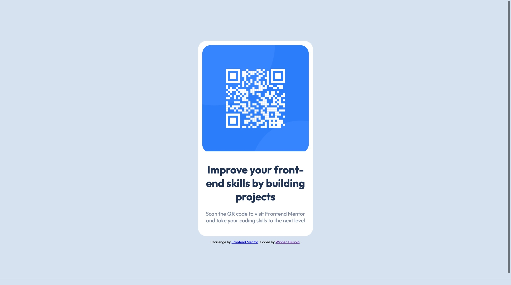

# Frontend Mentor - QR code component solution

This is a solution to the [QR code component challenge on Frontend Mentor](https://www.frontendmentor.io/challenges/qr-code-component-iux_sIO_H). Frontend Mentor challenges help you improve your coding skills by building realistic projects. 

## Overview

### Screenshot

### Links

- Solution URL: [Click Here](https://www.frontendmentor.io/solutions/qr-code-DGtLIHG_Ww)
- Live Site URL: [Click here](https://guileless-lolly-0e3648.netlify.app/)

## My process

### Built with

- Semantic HTML5 markup
- CSS custom properties
- Flexbox
- SASS
- Mobile-first workflow

### What I learned

Recap over some of my major learnings while working through this project.

### Useful resources

- [Example resource 1](https://www.example.com) - This helped me for XYZ reason. I really liked this pattern and will use it going forward.
- [Example resource 2](https://www.example.com) - This is an amazing article which helped me finally understand XYZ. I'd recommend it to anyone still learning this concept.

## Author

- Website - [Winner Olusola](https://www.winnerolusola.xyz)
- Frontend Mentor - [@D0NC0DE](https://www.frontendmentor.io/profile/D0NC0DE)
- Twitter - [@de_ddon](https://www.twitter.com/de_ddon)

